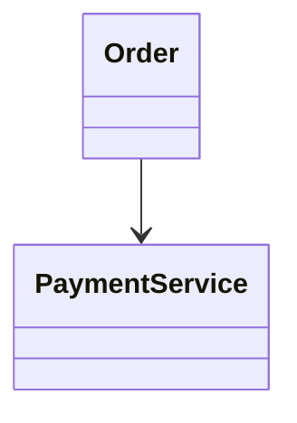

# Module 1: Introduction to Software Design

Software design is the discipline of deciding how software should be structured before and while it is implemented. In low-level design (LLD), the goal is not simply to draw class diagrams or write classes that compile. The goal is to make deliberate decisions about responsibilities, relationships, dependencies, state, behavior, and change.

This module establishes the mental model used throughout the rest of the LLD curriculum. The central idea is:

> **Good software design makes important decisions explicit, gives responsibilities clear owners, controls dependencies, and keeps the cost of change manageable.**

---

## What is Software Design?

Software design is the set of decisions that determines how a software system is organized and how its parts collaborate to satisfy requirements.

A requirement such as:

> "Customers should be able to place an order."

does not tell us directly:

- Which object owns the order?
- Who validates the cart?
- Who calculates the total?
- Who reserves inventory?
- Who initiates payment?
- Where should the business rules live?
- How should failures be handled?
- Which components are allowed to depend on which?
- What happens when the requirement changes?

Those are design questions.

A useful way to think about design is:

```text
Requirements
     |
     v
Design decisions
     |
     v
Structure + responsibilities + dependencies
     |
     v
Code
     |
     v
Runtime behavior
```

The code is therefore not separate from design. Code is one of the places where design becomes concrete.

### Software design as decisions

A design is not merely a collection of classes. It is a collection of decisions.

For an order-processing system, we might decide:

- `Order` owns its lifecycle.
- `OrderService` coordinates an application use case.
- `InventoryService` owns inventory operations.
- `PaymentGateway` is represented through an abstraction.
- Database access is hidden behind a repository.
- Payment failures must not silently create successful orders.
- Order state transitions must be explicit.

Each of these decisions determines how the system behaves and how easily it can change.

For example, consider:

```java
public class OrderService {

    public void placeOrder(Order order) {
        // everything happens here
    }
}
```

This compiles, but the design question is whether `OrderService` has become responsible for too much.

A more deliberate structure might be:

```java
public class Order {
    public void confirm() {
        // enforce order-level rules
    }
}

public interface Inventory {
    void reserve(Order order);
}

public interface PaymentProcessor {
    PaymentResult charge(Money amount);
}

public class OrderService {

    private final Inventory inventory;
    private final PaymentProcessor paymentProcessor;

    public OrderService(
            Inventory inventory,
            PaymentProcessor paymentProcessor) {
        this.inventory = inventory;
        this.paymentProcessor = paymentProcessor;
    }

    public void place(Order order) {
        order.validateForPlacement();
        inventory.reserve(order);
        paymentProcessor.charge(order.total());
        order.confirm();
    }
}
```

The important improvement is not the number of classes. It is the ownership of decisions.

### Structure and communication

Design determines how objects communicate.

Suppose:

```text
OrderService
   |
   +--> InventoryService
   |
   +--> PaymentService
   |
   +--> NotificationService
```

The arrows represent dependencies or collaboration. Every dependency creates a relationship that must be understood.

A design should answer:

1. Who calls whom?
2. Why does that dependency exist?
3. What does the caller need to know?
4. What does the collaborator own?
5. What happens if the collaborator changes?
6. What happens if the collaborator fails?

A good design keeps these relationships intentional.

### Design enforced by code

Documentation can say:

> "Only the Order aggregate may change the order status."

But if the code exposes:

```java
order.setStatus(OrderStatus.CANCELLED);
```

any caller can bypass that rule.

A stronger design makes invalid operations difficult or impossible:

```java
public class Order {

    private OrderStatus status;

    public void cancel() {
        if (status != OrderStatus.CONFIRMED) {
            throw new IllegalStateException(
                    "Only confirmed orders can be cancelled");
        }

        status = OrderStatus.CANCELLED;
    }

    public OrderStatus status() {
        return status;
    }
}
```

The design is now expressed by the API itself.

This principle is important throughout LLD:

> **Prefer APIs that make valid behavior easy and invalid behavior difficult.**

### Design vs diagrams

A class diagram is a representation of a design. It is not the design itself.

Consider:



The diagram shows a relationship, but it does not explain:

- Why the relationship exists.
- Who owns payment state.
- Whether payment is synchronous.
- What happens after a timeout.
- Whether retries are safe.
- Whether the dependency should be an interface.
- Whether payment belongs inside or outside the order transaction.

Therefore:

```text
Diagram != Design

Diagram
   |
   +--> communicates structure

Design
   |
   +--> explains decisions
   +--> defines responsibilities
   +--> defines behavior
   +--> defines dependencies
   +--> handles change and failure
```

### Runtime behavior

A design must eventually survive runtime behavior.

Two systems can have nearly identical class diagrams but behave very differently under:

- concurrent requests,
- failures,
- retries,
- slow dependencies,
- partial completion,
- invalid input,
- database failures,
- changing requirements.

For example, an order flow may look simple:

```text
Create Order
    |
    v
Reserve Inventory
    |
    v
Charge Payment
    |
    v
Confirm Order
```

But production behavior immediately raises questions:

- What if inventory succeeds but payment fails?
- What if payment succeeds but the response times out?
- What if the client retries the request?
- What if two requests reserve the final item?
- What if notification delivery fails?
- What if the process crashes between two steps?

Good design begins considering these questions before they become production incidents.

### Real-world example

A food-delivery application might contain:

```text
Customer
Restaurant
Menu
Cart
Order
Payment
Delivery
Notification
```

A naive design might put everything inside one `FoodDeliveryService`.

A better design asks which concepts have meaningful responsibilities:

```text
Cart
 └── manages cart items

Order
 └── manages order lifecycle

Payment
 └── manages payment state

Delivery
 └── manages delivery assignment/status

Notification
 └── manages notification delivery
```

The objective is not to create a class for every noun. The objective is to give important business decisions an appropriate owner.

### Interview perspective

When asked "What is software design?", a strong answer is:

> Software design is the process of making explicit decisions about structure, responsibilities, dependencies, state, and behavior so that the software can satisfy current requirements while remaining understandable and reasonably adaptable to future change.

A weak answer focuses only on UML diagrams or design patterns.

### Key Takeaways

- Software design is primarily about decisions.
- Structure determines how responsibilities and dependencies are organized.
- Code is one mechanism through which design is enforced.
- Diagrams communicate design but do not replace design reasoning.
- Runtime behavior, failures, and concurrency expose whether a design is actually sound.
- Good design gives important decisions clear ownership.

---

## High-Level vs Low-Level Design — Drawing the Boundary

High-Level Design (HLD) and Low-Level Design (LLD) operate at different levels of abstraction.

The boundary is useful, but it is not absolute.

### HLD vs LLD

HLD generally focuses on system-level structure:

```text
Client
  |
  v
API Gateway
  |
  +--> Order Service
  |
  +--> Payment Service
  |
  +--> Inventory Service
```

LLD focuses on the internal design of a selected component:

```text
OrderController
      |
      v
OrderService
      |
      +--> OrderRepository
      |
      +--> InventoryClient
      |
      +--> PaymentProcessor
```

The distinction can be summarized as:

| HLD | LLD |
|---|---|
| System boundaries | Class/component boundaries |
| Services | Objects |
| Databases | Repositories/entities |
| Communication between services | Method/object interactions |
| Deployment topology | Internal structure |
| Scalability strategy | Responsibility and collaboration |
| Technology/system choices | Implementation-oriented design |

This does not mean HLD is "important" and LLD is "implementation detail." Both contain important architectural decisions at their respective levels.

### Scope of decisions

Consider an e-commerce system.

An HLD question might be:

> Should payments be handled by a separate service?

An LLD question might be:

> Which abstraction should the order flow depend on to initiate payment?

HLD:

```text
Order Service
       |
       v
Payment Service
```

LLD:

```java
public interface PaymentProcessor {
    PaymentResult process(PaymentRequest request);
}
```

and:

```java
public class OrderService {

    private final PaymentProcessor paymentProcessor;

    public OrderService(PaymentProcessor paymentProcessor) {
        this.paymentProcessor = paymentProcessor;
    }
}
```

The two levels are connected. A system-level decision often creates constraints for component-level design.

### System-level decisions

Typical HLD decisions include:

- service boundaries,
- database selection,
- synchronous vs asynchronous communication,
- caching strategy,
- message broker selection,
- deployment topology,
- replication,
- scaling strategy.

For example:

```text
Order Service
      |
      | event
      v
Kafka
      |
      +--> Notification Service
      |
      +--> Analytics Service
```

The decision to publish an order event affects LLD.

The notification service now needs to decide:

- What is an event object?
- Who consumes it?
- How are duplicate events handled?
- Where is notification retry logic placed?
- What is the channel abstraction?

### Component-level decisions

LLD decisions include:

- class responsibilities,
- interfaces,
- method contracts,
- object relationships,
- state ownership,
- validation ownership,
- exception strategy,
- dependency direction,
- design patterns,
- concurrency controls.

For example:

```java
public interface NotificationChannel {
    void send(Notification notification);
}
```

Possible implementations:

```java
public class EmailChannel implements NotificationChannel {
    @Override
    public void send(Notification notification) {
        // send email
    }
}

public class SmsChannel implements NotificationChannel {
    @Override
    public void send(Notification notification) {
        // send SMS
    }
}
```

### Moving HLD/LLD boundary

The boundary changes with the scope of the problem.

Suppose the entire application is:

```text
Payment Service
```

At system level, this may be one component.

But when designing the Payment Service internally:

```text
PaymentController
       |
       v
PaymentApplicationService
       |
       +--> PaymentRepository
       |
       +--> PaymentGateway
       |
       +--> PaymentPolicy
```

Those details become the LLD.

Therefore, HLD and LLD should not be treated as completely separate disciplines.

> **The level of design depends on what boundary you are currently designing.**

### Interview perspective

If an interviewer asks for LLD and you spend most of the time discussing:

- Kubernetes,
- load balancers,
- database sharding,
- multi-region deployment,

you may be solving an HLD problem instead.

For LLD, bring the discussion toward:

```text
requirements
   ↓
entities
   ↓
responsibilities
   ↓
relationships
   ↓
interfaces
   ↓
workflows
   ↓
state/concurrency
```

### Key Takeaways

- HLD focuses primarily on system-level structure.
- LLD focuses primarily on internal component/object design.
- The boundary is contextual rather than absolute.
- HLD decisions influence LLD decisions.
- A strong engineer can move between both levels without confusing them.

---

## Software Architecture vs Software Design

Software architecture and software design overlap, but they emphasize different levels and consequences.

### Architecture vs design

Architecture usually addresses the major structural decisions that shape a system:

```text
System
 |
 +--> services
 +--> data stores
 +--> communication mechanisms
 +--> deployment boundaries
 +--> reliability boundaries
```

Software design usually goes deeper into how those parts are structured and collaborate.

For example:

**Architecture decision**

> Orders and payments are separate services.

**Design decision**

> `OrderService` depends on a `PaymentProcessor` abstraction rather than a concrete provider.

Architecture:

```text
Order Service ---> Payment Service
```

Design:

```text
OrderService ---> PaymentProcessor
                         ^
                         |
                  StripePaymentProcessor
```

### Scope of decisions

Architecture tends to answer:

- What are the major boundaries?
- Where does state live?
- How do major components communicate?
- What technologies or infrastructure constraints matter?
- What failure boundaries exist?
- What scaling characteristics are required?

Design tends to answer:

- Who owns this responsibility?
- What objects collaborate?
- Which abstraction represents variation?
- Where does this business rule live?
- How can this component be tested?
- What happens when this method fails?

### Reversibility

One useful architectural concept is **reversibility**.

Some decisions are cheap to change.

For example:

```text
Rename internal method
```

is usually inexpensive.

Other decisions are expensive:

```text
Choose a service boundary
Choose a database model
Choose synchronous vs asynchronous integration
Expose a public API contract
```

Once consumers depend on them, changing them can require coordinated migration.

A useful rule is:

> Spend more design effort on decisions that are expensive to reverse.

This does not mean every design decision needs a lengthy document. It means decision effort should be proportional to risk and cost of change.

### Architectural decisions

Examples:

```text
Decision:
Payment is isolated behind a service boundary.

Reason:
Payment provider integration changes independently from order processing.

Trade-off:
Additional network call and distributed failure modes.

Alternative:
Keep payment inside the order service.

Rejected because:
The payment capability has independent operational and security concerns.
```

This is architecture expressed as reasoning rather than technology vocabulary.

### Architecture emerging from design decisions

Architecture is not always created in one meeting.

Repeated local decisions can produce system-wide structure.

For example:

```text
Feature A
  -> interface
  -> repository abstraction
  -> service boundary

Feature B
  -> interface
  -> repository abstraction
  -> service boundary

Feature C
  -> interface
  -> repository abstraction
  -> service boundary
```

Over time, consistent design decisions may establish architectural boundaries.

The reverse is also true:

```text
Architecture
      |
      v
constraints
      |
      v
local design decisions
```

Architecture and design continuously influence each other.

### Key Takeaways

- Architecture deals with major structural decisions and boundaries.
- Design focuses more deeply on internal structure and behavior.
- Reversibility matters when deciding how much analysis a decision deserves.
- Architecture can emerge from repeated design decisions.
- Good engineers explain not only what they chose but why.

---

## Functional vs Non-Functional Requirements

Requirements describe what the system must achieve and the constraints under which it must operate.

The distinction between functional and non-functional requirements is fundamental to LLD because requirements directly influence design.

### Functional requirements

Functional requirements describe system behavior.

Examples:

- A customer can create an order.
- A user can cancel an order.
- A payment can be initiated.
- An administrator can deactivate an account.
- A driver can accept a ride.
- A notification can be sent by email.

A functional requirement usually answers:

> **What should the system do?**

Example:

> The system shall allow a customer to place an order containing one or more products.

That leads to design questions:

```text
Who creates the order?
Who validates the items?
Who calculates the total?
Who checks inventory?
Who owns order state?
```

### Non-functional requirements

Non-functional requirements describe qualities or constraints.

Examples:

- API latency should remain below a target.
- The system should support a certain request rate.
- Payment operations must be idempotent.
- The system should tolerate temporary dependency failures.
- Sensitive information must not be logged.
- The service should remain available during a dependency outage.

They answer questions such as:

> How fast?

> How reliable?

> How secure?

> How scalable?

> How observable?

### Performance constraints

Performance requirements influence design.

Suppose:

> Product search should respond within 200 ms for normal traffic.

A design that performs five sequential database calls on every request may not satisfy the requirement.

Possible design responses could include:

- appropriate indexing,
- caching,
- reduced round trips,
- batching,
- asynchronous processing where appropriate,
- precomputed read models.

The key is not:

> "Performance means Redis."

The key is:

> "The requirement creates a performance constraint, and the design must satisfy it."

### Quantifiable requirements

Whenever possible, NFRs should be measurable.

Weak:

> The API should be fast.

Better:

> 95% of requests should complete within 200 ms under the expected workload.

Weak:

> The system should support many users.

Better:

> The system should support 2,000 requests per second during the expected peak.

Quantification changes design discussions from vague opinions into engineering constraints.

### Requirements influencing architecture

Requirements can force structural decisions.

Consider:

> Payments must be processed independently from the main order workflow.

This may influence a service boundary.

Consider:

> Notification delivery may take several seconds and must not block order creation.

This may influence asynchronous processing:

```text
Order Service
     |
     | publish event
     v
Message Broker
     |
     v
Notification Consumer
```

Consider:

> Only one successful reservation may exist for a limited inventory item.

This introduces concurrency and consistency requirements.

The relationship is:

```text
Requirement
    |
    v
Constraint
    |
    v
Design decision
    |
    v
Implementation
```

### Requirements checklist for LLD

Before designing, identify:

```text
Functional
- What can users do?
- What operations exist?
- What state changes occur?

Non-functional
- What latency is required?
- What scale is expected?
- What consistency is required?
- What availability is required?
- What security constraints exist?
- What failure behavior matters?

Constraints
- Existing APIs?
- Existing database?
- Existing infrastructure?
- Technology restrictions?
```

### Interview perspective

A strong LLD candidate does not immediately start writing classes.

First establish the requirements.

For example:

> "Before I design the classes, I want to confirm whether cancellation is allowed after payment and whether inventory is reserved before or after payment."

That single question can change the entire workflow.

### Key Takeaways

- Functional requirements describe behavior.
- Non-functional requirements describe qualities and constraints.
- Performance requirements should be measurable when possible.
- Requirements determine design constraints.
- Do not design before understanding the important requirements.

---

## The Software Design Process and Design Thinking

Software design is iterative. A good design rarely appears perfectly on the first attempt.

### Software design process

A practical design process is:

```text
Understand problem
      |
      v
Identify requirements
      |
      v
Define scope
      |
      v
Identify important concepts
      |
      v
Assign responsibilities
      |
      v
Define relationships
      |
      v
Design interactions
      |
      v
Check constraints
      |
      v
Review trade-offs
      |
      v
Refine
```

The process is deliberately iterative.

### Iterative design

Suppose the initial order design is:

```text
OrderService
```

During review, we discover that it handles:

- pricing,
- inventory,
- payment,
- notifications,
- refunds.

We then refine:

```text
OrderService
    |
    +--> PricingService
    +--> InventoryService
    +--> PaymentProcessor
    +--> NotificationPublisher
```

The goal is not to maximize the number of classes. The goal is to reduce inappropriate responsibility and dependency.

### Design thinking

Design thinking in software means continuously asking:

- What problem am I solving?
- What must remain stable?
- What is likely to change?
- Who should own this decision?
- What does this object need to know?
- What does it not need to know?
- What happens when this operation fails?

### Define

Before implementation, define the problem clearly.

Instead of:

> "Build a payment system."

Define:

> "Design an API and internal model that accepts a payment request, prevents duplicate processing, delegates charging to a payment provider, and exposes a stable payment state."

This definition creates a much clearer design boundary.

### Design activities

Typical activities include:

1. Requirement analysis.
2. Scope definition.
3. Domain modeling.
4. Responsibility assignment.
5. Dependency analysis.
6. Interaction design.
7. State modeling.
8. Failure analysis.
9. Concurrency analysis.
10. Trade-off evaluation.

Not every problem requires all activities at the same depth.

### Problem understanding

The most expensive design mistake is often solving the wrong problem.

Suppose an interviewer asks:

> "Design a parking lot."

You should clarify:

- Multiple vehicle types?
- Multiple floors?
- Different spot sizes?
- Pricing?
- Reservations?
- Entry/exit tickets?
- Real-time availability?
- Concurrent entry?

The answers determine the model.

### Design review questions

A useful review asks:

```text
Responsibilities
- Is each responsibility owned by a reasonable component?

Dependencies
- Are dependencies necessary?
- Are they pointing in a sensible direction?

Change
- What happens when a requirement changes?

State
- Who owns mutable state?

Failure
- What happens when a collaborator fails?

Concurrency
- Can two operations conflict?

Testability
- Can important behavior be tested in isolation?
```

### Key Takeaways

- Design is iterative.
- Problem understanding comes before class design.
- Design activities should be proportional to the problem.
- Reviewing responsibility, dependencies, change, failure, and state exposes weaknesses early.
- Refinement is part of design, not evidence that the first design failed.

---

## Characteristics of Good Software Design

A good design is not simply "clean code." It is a structure that makes important changes manageable.

### Maintainability

Maintainability means the system can be understood, modified, tested, and operated without disproportionate effort.

Consider:

```java
public class OrderService {

    public void placeOrder(Order order) {
        // 700 lines of logic
    }
}
```

Even if it works, its change cost is likely high.

A better design can separate meaningful responsibilities:

```text
Order
PricingPolicy
Inventory
PaymentProcessor
OrderRepository
NotificationPublisher
```

Again, separation is valuable only when the responsibilities are genuinely distinct.

### Coupling

Coupling describes how strongly components depend on one another.

Tight coupling:

```text
OrderService
   |
   +--> StripeClient
   |
   +--> MySqlOrderRepository
```

A change in Stripe integration or database implementation directly affects the service.

More flexible:

```text
OrderService
   |
   +--> PaymentProcessor
   |
   +--> OrderRepository
```

Implementations can change behind abstractions.

Coupling is not inherently bad. Some coupling is necessary.

The objective is:

> **Keep dependencies intentional, minimal, and aligned with stable contracts.**

### Cohesion

Cohesion describes how closely the responsibilities within a component belong together.

High cohesion:

```text
Order
 ├── addItem()
 ├── removeItem()
 ├── calculateTotal()
 └── confirm()
```

Low cohesion:

```text
OrderManager
 ├── createOrder()
 ├── sendEmail()
 ├── generatePdf()
 ├── calculateTax()
 ├── resizeImage()
 └── writeAuditFile()
```

High cohesion usually makes code easier to understand and change.

### Cost of change

A central design question is:

> If this requirement changes, how many places must I modify?

Suppose:

> Add UPI payments.

A design with:

```java
if (paymentType == CARD) { ... }
else if (paymentType == UPI) { ... }
else if (paymentType == CASH) { ... }
```

spread throughout the system can create a large change surface.

A strategy-oriented design can isolate payment variation:

```java
public interface PaymentProcessor {
    PaymentResult process(PaymentRequest request);
}
```

The design should be judged by the actual expected variation. Abstraction is useful when it reduces meaningful change cost, not simply because "interfaces are good."

### Change impact

Imagine a notification system:

```text
NotificationService
     |
     +--> Email
     +--> SMS
     +--> Push
```

If adding WhatsApp requires modifying unrelated order logic, coupling is probably too high.

A better boundary is:

```text
Order
  |
  v
NotificationPublisher
  |
  v
Notification system
  |
  +--> Email
  +--> SMS
  +--> Push
  +--> WhatsApp
```

The order domain does not need to understand channel-specific implementation.

### Measuring design quality

Design quality is not a single metric.

Useful indicators include:

- change impact,
- dependency count and direction,
- cohesion,
- testability,
- complexity,
- duplication where duplication is harmful,
- number of invalid states representable,
- clarity of responsibilities,
- failure isolation.

A useful practical measure is:

> **How difficult is the next reasonable change?**

For example:

```text
Requirement:
Add another payment provider.

Design A:
Modify 8 unrelated classes.

Design B:
Add one implementation and configure it.

Design B has a smaller change surface.
```

That does not automatically prove B is better, but it is strong evidence.

### Key Takeaways

- Good design reduces unnecessary change cost.
- High cohesion groups related responsibilities.
- Loose coupling limits change propagation.
- Design quality should be evaluated through maintainability, testability, clarity, and change impact.
- The goal is not zero coupling; it is appropriate coupling.

---

## Common Software Design Mistakes

Many LLD mistakes come from solving complexity by adding more structure instead of improving responsibility ownership.

### God objects

A God object knows or does too much.

Example:

```java
class ApplicationManager {
    void createUser() {}
    void chargePayment() {}
    void sendEmail() {}
    void reserveInventory() {}
    void generateInvoice() {}
    void exportReport() {}
}
```

Problems:

- low cohesion,
- high coupling,
- difficult testing,
- large change impact,
- unclear ownership.

A better design identifies meaningful responsibilities.

### Premature abstraction

Abstraction has a cost.

Consider:

```java
interface UserProcessor {}
class DefaultUserProcessor implements UserProcessor {}
```

If there is only one stable implementation and no meaningful variation, the abstraction may provide little value.

A useful rule:

> Introduce abstraction around meaningful variation or a boundary that needs isolation.

Do not create interfaces simply because a codebase "should have interfaces."

### Poor design decisions

Common examples:

- placing business rules in controllers,
- letting DTOs become domain objects,
- exposing mutable state unnecessarily,
- making services depend on concrete infrastructure,
- allowing any class to mutate important state,
- mixing persistence logic with business rules.

### Design review

A design review should ask:

```text
What is the most likely change?
What is the most dangerous failure?
Which object owns this state?
Which class knows too much?
Which dependency is unnecessary?
Can invalid state be created?
Can this behavior be tested?
```

The purpose is not to criticize code. It is to expose assumptions before those assumptions become expensive.

### Refactoring prevention

Some design problems are cheaper to prevent than to fix.

For example:

```text
Controller
    |
    +--> SQL
    +--> business rules
    +--> payment provider
    +--> email
```

may work initially.

Later, every change requires touching the controller.

A better initial boundary:

```text
Controller
    |
    v
Application Service
    |
    +--> Domain
    +--> Repository
    +--> External gateway
```

Good design reduces the amount of structural refactoring required later.

### Common mistake: pattern obsession

A developer may see a small variation and immediately create:

```text
Factory
Abstract Factory
Strategy
Factory Factory
```

This is not good design.

A pattern is useful only when its structure solves an actual problem.

### Common mistake: designing for every possible future

Overengineering is also a design mistake.

You usually do not need to support:

- ten payment providers,
- five databases,
- seven message brokers,
- multiple cloud vendors,

if the requirements contain none of these needs.

Design for known requirements and credible variation points.

### Key Takeaways

- God objects create responsibility and dependency problems.
- Premature abstraction increases complexity without guaranteed value.
- Design review should focus on ownership, dependencies, change, failure, and testability.
- Good boundaries reduce future refactoring.
- Design patterns and abstractions should solve actual problems.

---

## How to Read and Write Design Documents

A design document records important decisions so that developers can understand not only what was built, but why.

### Design documents

A useful design document commonly contains:

```text
1. Problem
2. Goals
3. Non-goals
4. Requirements
5. Proposed design
6. Key decisions
7. Alternatives
8. Trade-offs
9. Failure considerations
10. Testing/operational considerations
```

The exact format can vary.

### Decisions

A decision should state:

```text
Decision:
Use a repository abstraction between the domain/application layer and persistence.

Reason:
The application logic should not depend directly on the persistence implementation.

Trade-off:
Adds an abstraction and another type to the codebase.

Alternative:
Use the persistence implementation directly.

Why rejected:
Would couple business/application logic to storage details.
```

This is more useful than:

> "We use repositories because repositories are a best practice."

### Non-goals

Non-goals prevent scope creep.

Example:

```text
Goals:
- Support card and UPI payments.
- Prevent duplicate payment requests.
- Persist payment state.

Non-goals:
- Multi-currency settlement.
- Fraud detection.
- Payment reconciliation automation.
```

This tells reviewers what the design intentionally does not solve.

### Alternatives

A strong design document acknowledges reasonable alternatives.

Example:

| Decision | Chosen | Alternative | Trade-off |
|---|---|---|---|
| Payment integration | Adapter abstraction | Direct provider client | More flexibility vs more structure |
| Notification | Async event | Synchronous call | Better isolation vs eventual delivery |
| Pagination | Cursor | Offset | Stable large datasets vs simpler implementation |

The goal is not to list every imaginable alternative. It is to explain meaningful choices.

### Design review

A reviewer should be able to ask:

- What problem is this solving?
- What assumptions exist?
- What changes are expected?
- What are the failure modes?
- Why this design instead of the alternatives?
- What would cause us to revisit the decision?

### Recording trade-offs

Every meaningful design has trade-offs.

For example:

```text
Abstraction
+
Lower coupling
+
Better substitution
-
More types
-
More indirection
```

The correct design depends on context.

### Example design document fragment

```text
Problem:
Orders must initiate payment without depending directly on a specific payment provider.

Decision:
Introduce PaymentProcessor as an application-facing abstraction.

Consequences:
- Order flow does not depend directly on provider SDKs.
- Provider implementations can change independently.
- Tests can use a fake processor.
- An additional abstraction must be maintained.

Non-goals:
- Building a complete payment orchestration platform.
```

### Key Takeaways

- Design documents should capture decisions and reasoning.
- Non-goals protect the design from uncontrolled scope expansion.
- Alternatives make trade-offs visible.
- A useful design document explains why, not just what.
- Good documentation records decisions that would otherwise be lost.

---

## The Framework: How to Approach LLD Problems

LLD interviews become much easier when approached systematically.

The objective is not to immediately produce perfect classes. The objective is to demonstrate structured reasoning.

### Restate the problem

Start by restating the problem in your own words.

Example:

> "We need to design an order-management component that allows customers to create and cancel orders, validates inventory, initiates payment, and tracks the order lifecycle."

This confirms shared understanding.

### Define scope

Explicitly identify what is inside and outside the problem.

For example:

```text
In scope:
- Order creation
- Inventory reservation
- Payment initiation
- Order state transitions

Out of scope:
- Product search
- Recommendation engine
- Tax calculation service
- Delivery routing
```

Scope prevents unnecessary design work.

### Identify requirements

Separate functional and non-functional requirements.

```text
Functional:
- Create order
- Cancel order
- View order

Constraints:
- Cannot confirm without inventory
- Payment must not be charged twice

NFR:
- API should remain responsive
- Operations must be observable
```

### Design structure

Identify the important concepts.

For an order system:

```text
Order
OrderItem
Inventory
Payment
Customer
```

Then assign responsibilities.

```text
Order
  -> owns order state

OrderItem
  -> represents purchased item

Inventory
  -> owns stock reservation

PaymentProcessor
  -> performs payment operation
```

### Analyze dependencies

Ask:

> Who needs to know about whom?

Prefer dependency direction that follows responsibility.

Example:

```text
OrderService
    |
    +--> OrderRepository
    |
    +--> Inventory
    |
    +--> PaymentProcessor
```

Avoid unnecessary chains such as:

```text
Order -> User -> Account -> Payment -> Provider
```

when the order only needs a specific payment capability.

### Consider NFRs

Do not leave non-functional requirements until the end.

For concurrency:

> Can two requests reserve the same inventory?

For failure:

> What if payment times out?

For performance:

> Which operations are on the critical path?

For security:

> Who is authorized to cancel the order?

### Review the design

Before finishing, walk through the main workflow.

```text
Client
  |
  v
OrderController
  |
  v
OrderService
  |
  +--> Inventory
  |
  +--> PaymentProcessor
  |
  +--> OrderRepository
```

Then test the design mentally:

```text
Happy path
Failure path
Duplicate request
Concurrent request
Invalid request
Dependency timeout
Requirement change
```

If the design cannot explain these scenarios, it is incomplete.

### LLD interview framework

A practical interview sequence:

```text
1. Restate the problem
2. Clarify requirements
3. Define scope
4. Identify core entities
5. Assign responsibilities
6. Define relationships
7. Identify abstractions only where justified
8. Walk through important interactions
9. Discuss state and concurrency
10. Discuss failure behavior
11. Review trade-offs
12. Handle follow-up changes
```

### Example: payment design thought process

Requirement:

> Design a payment component that supports multiple payment providers.

Start with variation:

```text
Provider may change.
```

Possible abstraction:

```java
public interface PaymentProcessor {
    PaymentResult process(PaymentRequest request);
}
```

Implementations:

```java
public class StripePaymentProcessor implements PaymentProcessor {
    @Override
    public PaymentResult process(PaymentRequest request) {
        // provider-specific logic
        return PaymentResult.success();
    }
}

public class RazorpayPaymentProcessor implements PaymentProcessor {
    @Override
    public PaymentResult process(PaymentRequest request) {
        // provider-specific logic
        return PaymentResult.success();
    }
}
```

The important reasoning is:

```text
Requirement
    ↓
Provider variation
    ↓
Stable application capability
    ↓
PaymentProcessor abstraction
    ↓
Provider-specific implementations
```

But if the requirement says:

> "We only support one provider and there is no foreseeable provider variation."

then introducing a large hierarchy may be unnecessary.

### What interviewers are evaluating

LLD interviews commonly test whether you can:

- understand ambiguous requirements,
- identify meaningful objects,
- assign responsibilities,
- manage dependencies,
- choose appropriate abstractions,
- reason about change,
- identify concurrency issues,
- discuss failure behavior,
- explain trade-offs.

They are usually not testing how many design patterns you can name.

### A compact mental model

When stuck, ask five questions:

```text
1. What changes?
2. Who owns the changing decision?
3. What should remain stable?
4. Who should depend on whom?
5. What happens when things fail or happen concurrently?
```

These five questions often reveal the structure of a good LLD.

### Final Module Perspective

The rest of the LLD curriculum builds on this module.

You will later study:

```text
OOP
  ↓
Design Principles
  ↓
UML
  ↓
Design Patterns
  ↓
Domain Modeling
  ↓
API Design
  ↓
Persistence
  ↓
Concurrency
  ↓
Event-Driven Design
  ↓
Reliability
  ↓
Case Studies
  ↓
Advanced LLD Interviews
```

The important point is that these are not isolated topics.

For example:

```text
OOP
  -> provides language-level modeling tools

SOLID
  -> helps organize responsibilities and dependencies

Patterns
  -> provide reusable structures for recurring design problems

Domain modeling
  -> gives business concepts and rules clear ownership

Persistence
  -> separates business behavior from storage concerns

Concurrency
  -> forces explicit thinking about shared state and atomicity

Event-driven design
  -> changes communication and consistency models

Reliability
  -> forces design to account for failure

Case studies
  -> combine all of the above
```

---

## Key Takeaways

- Software design is a discipline of making explicit decisions about structure, responsibility, dependencies, state, and behavior.
- Good design is not the same as drawing diagrams or using many design patterns.
- HLD and LLD represent different levels of design; the boundary depends on the system boundary being considered.
- Architecture focuses on major structural and system-level decisions, while design goes deeper into internal organization and collaboration.
- Functional requirements describe behavior; non-functional requirements establish constraints and quality targets.
- Requirements should be understood before classes are designed.
- Good software design emphasizes maintainability, appropriate coupling, high cohesion, and manageable change impact.
- God objects, premature abstraction, pattern obsession, and overengineering are common design failures.
- Design documents should record decisions, alternatives, non-goals, and trade-offs.
- LLD interviews reward structured reasoning more than pattern memorization.
- A reliable LLD process is:

```text
Restate
  ↓
Clarify
  ↓
Scope
  ↓
Identify
  ↓
Assign responsibilities
  ↓
Define relationships
  ↓
Design interactions
  ↓
Consider NFRs
  ↓
Review trade-offs
```

- The most useful design question is often:

> **"If this requirement changes, what will have to change in my design?"**

That question connects software design theory to real engineering.

---

<!-- CONTINUE FROM: Module 2 > Introduction to OOP and the Java Memory Model -->
